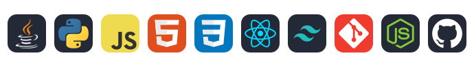

---
<h3 align="Center">✨About me ✨</h3>

Hello, My name is **Deandre Chandler** and I'm a **computer science** transfer student at **SDSU**. I love turing ideas into reality. I'm into building **software** that people will actually **use** and **benefit** from. Outside, you'll find me hiking, at the gym, or doing BJJ.

- Building **backend** skills: APIs, servers, and data flow
- Working toward **full-stack**, from database to UI
- Focused on the product loop: find the **problem** **prototype**, **iterate**
- Integrating **LLMs** and **AI** APIs into real products
- Building mobile-first, cross-platform apps with **React Native**
- Member of SDSU's **App Dev Club** and **AI Club**

 **🌐 Personal website:** pending...

---
<h3 align="Center">🚀Languages & Tools 🚀</h3>

  

---
<h3 align="Center">🔋Contribution Activity 🔋</h3>

  <picture>
    <source media="(prefers-color-scheme: dark)" srcset="https://raw.githubusercontent.com/DeandrexChandler/DeandrexChandler/output/bomberman-contribution-graph-dark.svg">
    <source media="(prefers-color-scheme: light)" srcset="https://raw.githubusercontent.com/DeandrexChandler/DeandrexChandler/output/bomberman-contribution-graph.svg">
    
  </picture>

